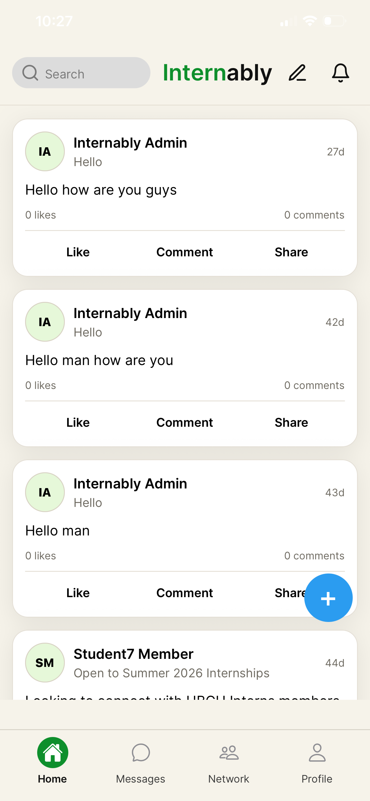
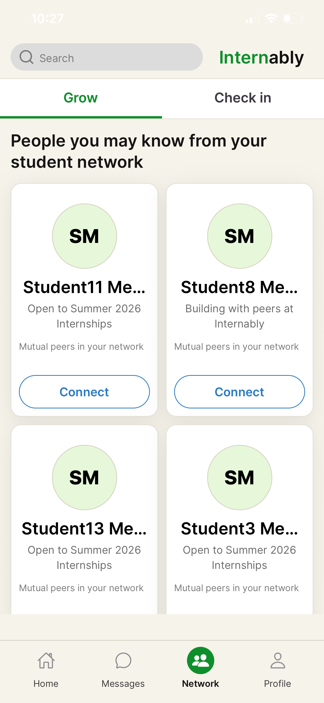
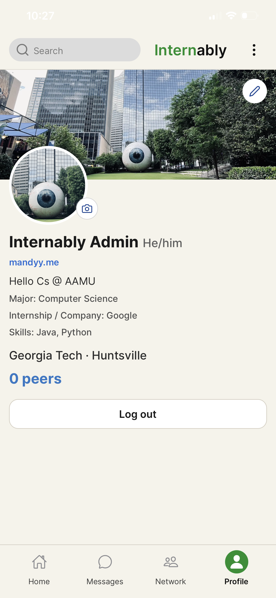
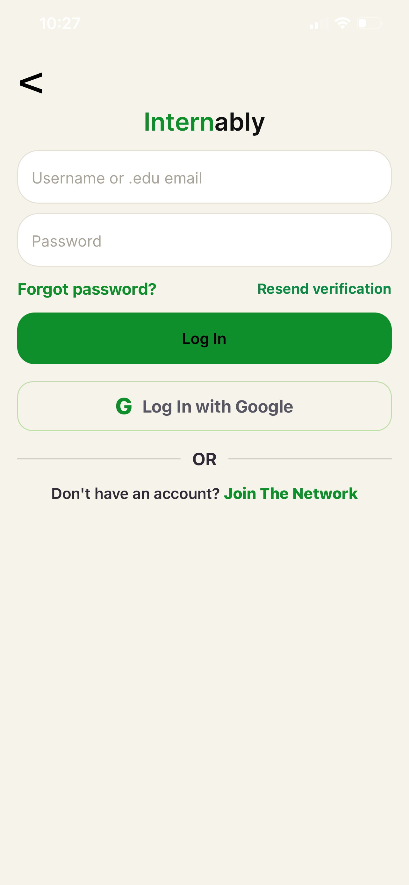

# Internably

**Internably** is a production-minded, full-stack student networking platform built for college students and interns to connect, share opportunities, and grow professional peer networks.

This project demonstrates end-to-end product engineering across **mobile**, **backend APIs**, **authentication/security**, **real-time messaging**, and **social graph workflows**.

---

## Product Highlights

- Student-only onboarding with `.edu` validation and email verification
- Mobile-first social feed (posts, likes, comments, sharing flow)
- Peer graph features (connect, remove peer, block with reason)
- 1:1 messaging with real-time gateway support
- Discoverability via suggestions/search and network growth surfaces
- Profile management (editable profile, portfolio link, media-ready avatar/banner flow)
- Admin moderation surfaces and review workflows

---

## Screens (Current UI)

The app currently includes polished flows for:

- **Home Feed** (post stream + create post)
- **Auth** (sign in, join network, Google auth entry)
- **Network** (Grow + Check in tabs with peer cards)
- **Profile** (cover/avatar, editable professional details)

> Tip: Add screenshots under `docs/screens/` and reference them here for a stronger recruiter-facing portfolio.

Example markdown (once images are added):


## 📱 Demo Screenshots







### Current Output Snapshot

- **Login flow** with `.edu` identity path + Google sign-in entry
- **Home feed** with post cards, engagement actions, and create-post trigger
- **Network discovery** with Grow/Check in tabs and connect actions
- **Profile experience** with editable professional identity, portfolio link, and peers count

---

## Tech Stack

### Mobile
- React Native
- Expo + Expo Router
- TypeScript
- TanStack Query
- Zustand
- React Hook Form + Zod

### Backend
- NestJS
- Prisma ORM
- PostgreSQL
- JWT (access + refresh)
- Socket.IO
- Swagger/OpenAPI

### Monorepo
- npm workspaces
- Shared packages for `ui`, `types`, and `config`

---

## Architecture

```text
apps/mobile  ->  NestJS API (apps/api)  ->  PostgreSQL (Prisma)
                     |\
                     | \-> Realtime gateway (Socket.IO)
                     \---> Email + media provider integrations
```

---

## Repository Structure

```text
internably-mvp/
  apps/
    mobile/      # Expo React Native app
    api/         # NestJS + Prisma API
  packages/
    ui/          # shared UI components/tokens
    types/       # shared TypeScript contracts
    config/      # shared config
```

---

## Core Features Implemented

### Authentication & Security
- Register / login / refresh / logout
- `.edu`-only registration policy
- Email verification flow
- Forgot/reset password
- Role-based access control (RBAC)
- Refresh-token rotation + session safety checks

### Social & Network
- Create/read/update/delete posts
- Likes and comments
- Connections lifecycle (request/accept/decline/remove)
- User suggestions and user search
- Profile view/edit and visitor profile route
- Peer blocking with reason tracking

### Messaging & Notifications
- Conversation list + chat thread
- Real-time message events via Socket.IO gateway
- Notification center with read/read-all
- Push token registration endpoints

### Media & Extensibility
- Media service abstraction for cloud providers
- Cloudinary-ready integration path
- API-first architecture suitable for iOS/Android/web clients

---

## API Surface (Selected)

- `POST /api/auth/register`
- `POST /api/auth/login`
- `GET /api/auth/me`
- `POST /api/posts`
- `GET /api/posts/feed`
- `POST /api/connections/request/:userId`
- `DELETE /api/connections/:userId`
- `POST /api/connections/block/:userId`
- `GET /api/conversations`
- `POST /api/conversations`
- `GET /api/notifications`
- `PATCH /api/users/me`
- `GET /api/users/suggestions`

Full docs available at: `http://localhost:4000/api/docs`

---

## Local Setup

### 1) Install dependencies

```bash
npm install
```

### 2) Configure environment

```bash
cp .env.example .env
cp apps/api/.env.example apps/api/.env
cp apps/mobile/.env.example apps/mobile/.env
```

### 3) Start PostgreSQL (Docker)

```bash
docker compose up -d postgres
```

### 4) Prisma setup

```bash
npm run db:generate
npm run db:migrate
npm run db:seed
```

### 5) Start API

```bash
npm run dev:api
```

### 6) Start Mobile

```bash
npm run dev:mobile
```

---

## Why This Project Is Resume-Strong

This codebase demonstrates:

- Building and shipping a real, multi-surface social product
- Designing secure auth and trust-gated onboarding
- Implementing scalable backend modules and clean API boundaries
- Translating product UX into reusable mobile component systems
- Owning end-to-end delivery from schema to UI

---

## Author

**Mandeep Khatri**

If you'd like, I can also generate a **one-page recruiter version** of this README (short + impact-focused) and keep this file as the detailed technical version.
